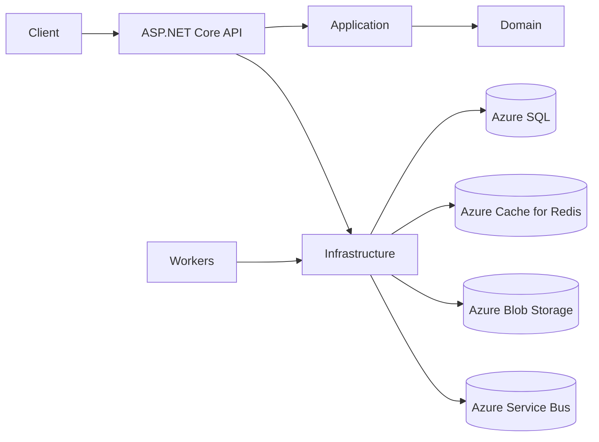

# Mind Unlocking Academy — WhisperWrap Block Zero Backend

Production-oriented modular monolith for the 21-day medical exam preparation challenge.

## Current architecture

The repository now contains a .NET 8 solution skeleton with API, Application, Domain, Infrastructure, Contracts, Workers, and test projects. Phase 1 establishes configuration validation, Identity-ready persistence, policy authorization, ProblemDetails, rate limiting, health checks, Serilog, OpenAPI, and an outbox worker foundation.

## Production status

This is not yet production complete. See [TODO.md](TODO.md) for phased requirements, risks, and next actions.
